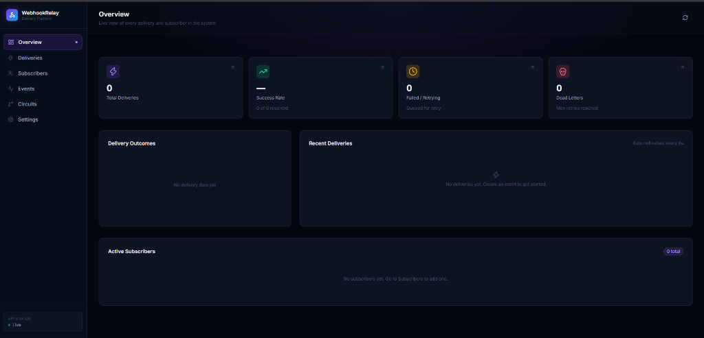
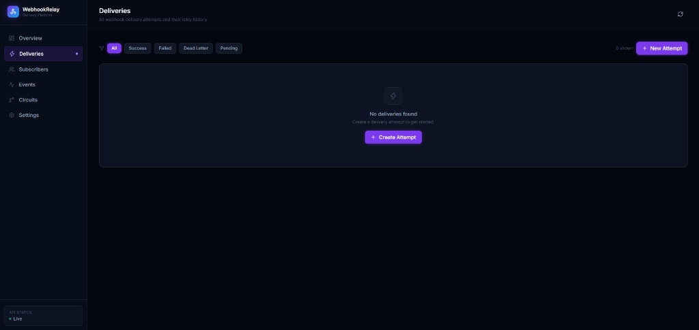
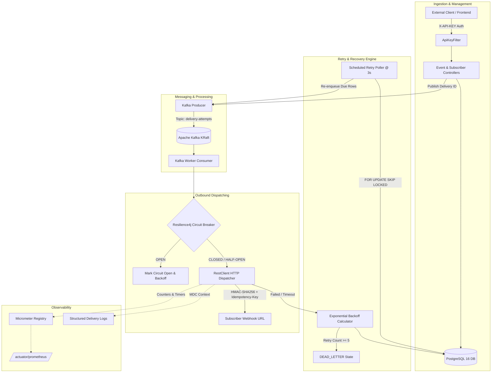

# ⚡ WebhookRelay — Enterprise Webhook Delivery Platform

[](https://openjdk.org/)
[](https://spring.io/projects/spring-boot)
[](https://kafka.apache.org/)
[](https://www.postgresql.org/)
[](https://resilience4j.readme.io/)
[](https://reactjs.org/)
[](https://www.docker.com/)

An enterprise-grade, distributed **Webhook Delivery & Reliability Engine** built with **Java 21**, **Spring Boot 4**, **Apache Kafka**, and **PostgreSQL**. Designed for high-throughput, fault-tolerant webhook dispatching, featuring **exponential backoff retries with lock-free concurrency**, **per-subscriber circuit breakers**, **cryptographic payload signing (HMAC-SHA256)**, **SSRF protection**, and a **real-time React observability console**.

---

## 📸 Showcase & Visual Tour

### 1. Operations & Observability Dashboard
Live telemetry covering dispatch volumes, delivery success rates, scheduled retry states, and dead-letter queues (DLQ).


### 2. Delivery Attempts & Retry History
Real-time inspection of individual webhook deliveries, idempotency keys, response codes, and manual replay actions.


---

## 🎯 Key Architectural Features

- **Decoupled Asynchronous Ingestion (Apache Kafka)**  
  Incoming event payloads are ingested and routed onto a Kafka topic (`delivery-attempts`), isolating event producers from downstream subscriber latency or outages.

- **Non-Blocking Concurrent Retry Scheduler (`SELECT ... FOR UPDATE SKIP LOCKED`)**  
  Failed deliveries transition to an exponential backoff state ($30 \times 2^{\text{retry\_no}}$ seconds). A scheduled background worker polls due retries using PostgreSQL's row-level `FOR UPDATE SKIP LOCKED`, guaranteeing that multiple horizontally scaled delivery nodes will never double-process or collide on the same delivery attempt.

- **Per-Subscriber Circuit Breaker Protection (Resilience4j)**  
  Isolates misbehaving or slow subscriber endpoints. Evaluated over a 5-call sliding window with a 50% failure threshold and 30-second cooldown period. Protects worker threads from hanging on unresponsive servers and prevents DDoS-ing downstream subscriber recovery.

- **End-to-End Delivery Idempotency**  
  Each delivery lifecycle maintains an immutable UUID (`deliveryId`). Retries propagate this identifier in the HTTP `Idempotency-Key` header, allowing subscriber receivers to deduplicate requests.

- **Security & Payload Verification**  
  - **HMAC-SHA256 Signatures**: Injected via the `Hmac-Sign` HTTP header, signed using unique per-subscriber secrets.  
  - **SSRF Hardening**: All subscriber registration URLs are inspected by `UrlSecurityValidator` to reject loopback, link-local, and private RFC-1918 IP addresses before saving.  
  - **Hashed API Key Authentication**: Protected endpoints require `X-API-KEY`, checked against SHA-256 hashed keys stored in the database.

- **Production Observability & Metrics**  
  Integrated with **Micrometer** and **Spring Boot Actuator**, exposing custom metrics (`delivery.attempts`, `delivery.duration`) partitioned by subscriber and outcome (`success`, `http_failure`, `network_failure`, `circuit_open`) to Prometheus. Distributed logging injects `deliveryId` directly into Logback MDC (`[%X{deliveryId}]`).

---

## 🏛️ System Architecture



---

## 🛠️ Tech Stack & Specifications

| Domain | Technology / Library | Version / Details |
|---|---|---|
| **Runtime & Language** | Java (OpenJDK) | Java 21 (compiled release 21) |
| **Backend Framework** | Spring Boot | 4.1.1 (Spring Framework 7.0.9) |
| **Web Server** | Embedded Apache Tomcat | 11.0.24 (Spring MVC) |
| **Message Broker** | Apache Kafka | Latest (KRaft Mode, single node broker) |
| **Persistence & ORM** | Spring Data JPA / Hibernate | Hibernate 7.4.5, HikariCP 7.0.2 |
| **Database Engine** | PostgreSQL | 16 (running via Docker) |
| **Fault Tolerance** | Resilience4j | 2.4.0 (Circuit Breaker Registry) |
| **Security** | Custom Filter & SHA-256 / HMAC | Constant-time hashing & HMAC-SHA256 |
| **Observability** | Spring Boot Actuator & Micrometer | Prometheus registry exporter, MDC logging |
| **Testing & Mocking** | JUnit 6, Mockito, Testcontainers | Testcontainers 1.21.3 (PostgreSQL module) |
| **Frontend Framework** | React 18 + Vite | Tailwind CSS, Framer Motion, Zustand, Axios |
| **Containerization** | Docker & Docker Compose | Multi-container setup (DB, Kafka, Backend, UI) |

---

## 🚀 Getting Started

### Prerequisites
- **JDK 21+** installed and available in `PATH`
- **Docker Desktop** installed and running
- **Node.js 20+** & npm (if running frontend outside container)
- **Maven** (or use the provided `mvnw` wrapper)

### 1. Environment Configuration
Create a `.env` file in the project root:
```env
DB_PASSWORD=your_secure_postgres_password
```

### 2. Infrastructure Setup (Docker)
Start the PostgreSQL and Kafka containers:
```bash
docker compose up -d postgres kafka
```

> **Note on Kafka Dual-Listener Architecture:**  
> The `docker-compose.yml` configures a dual-listener topology:
> - `HOST://localhost:9092` for services running on the host machine (e.g. your IDE).
> - `INTERNAL://kafka:29092` for container-to-container communication inside the Docker network.

### 3. Running the Backend
From the `Webhook-Delivery-Platform-Backend` directory:

```powershell
# Windows PowerShell
$env:DB_PASSWORD="your_secure_postgres_password"
.\mvnw.cmd spring-boot:run
```

Or run `WebhookDeliveryPlatformBackendApplication.java` directly from IntelliJ IDEA / Eclipse.

### 4. Running the Frontend Console
From the `Webhook-Delivery-Platform-Frontend/webhook-relay-frontend` directory:

```bash
npm install
npm run dev
```
Open **[http://localhost:5173](http://localhost:5173)** in your browser.

---

## 🧪 Testing & Quality Assurance

The project employs **Testcontainers** for true-to-production integration testing against actual PostgreSQL 16 instances.

### Running Test Suite
```powershell
.\mvnw.cmd test -DDB_PASSWORD="your_secure_postgres_password"
```

### Included Tests
- **`DeliveryAttemptIdempotencyTest`**: Bootstraps an ephemeral PostgreSQL 16 Testcontainer to verify:
  - Idempotency key stability across repeated attempts.
  - Foreign key constraints between `Event`, `Subscriber`, and `DeliveryAttempt`.
  - Transaction isolation and entity lifecycle persistence.
- **`DeliveryAttemptServiceTest`**: Unit tests verifying exponential backoff calculation and dead-letter queue (DLQ) state transitions after 5 consecutive failures.
- **`WebhookDeliveryPlatformBackendApplicationTests`**: Spring context load sanity check with Actuator and Kafka listeners.

---

## 💡 Engineering Challenges & Solutions

<details>
<summary><strong>1. Resolving Kafka Advertised Listeners across Host & Containers</strong></summary>

**Problem:** Outbound delivery workers running in the IDE could connect to Kafka, but consumers repeatedly failed with `UnknownHostException: kafka`.  
**Root Cause:** When running on host, the broker advertised `PLAINTEXT://kafka:9092`, which is only resolvable within the Docker bridge network.  
**Solution:** Implemented the dual-listener pattern in `docker-compose.yml`:
```yaml
KAFKA_LISTENERS: HOST://0.0.0.0:9092,INTERNAL://0.0.0.0:29092,CONTROLLER://0.0.0.0:9093
KAFKA_ADVERTISED_LISTENERS: HOST://localhost:9092,INTERNAL://kafka:29092
KAFKA_LISTENER_SECURITY_PROTOCOL_MAP: CONTROLLER:PLAINTEXT,HOST:PLAINTEXT,INTERNAL:PLAINTEXT
KAFKA_INTER_BROKER_LISTENER_NAME: INTERNAL
```
Host applications connect via `localhost:9092`, while containerized services connect via `kafka:29092`.
</details>

<details>
<summary><strong>2. Lock Contention & Race Conditions in Concurrent Schedulers</strong></summary>

**Problem:** Multiple instances of a retry poller could query and attempt to deliver the same failed webhook attempt simultaneously, causing double dispatches and duplicate subscriber hits.  
**Solution:** Native SQL pessimistic lock with row skipping:
```sql
SELECT * FROM delivery_attempt 
WHERE status = :status AND next_retry_at <= :now 
FOR UPDATE SKIP LOCKED;
```
Transactions lock the rows they are actively dispatching; subsequent poller queries simply skip locked rows and proceed without blocking.
</details>

<details>
<summary><strong>3. Windows Testcontainers Docker API Mismatch</strong></summary>

**Problem:** Testcontainers failed during container instantiation on Windows with empty daemon responses.  
**Solution:** Configured `~/.testcontainers.properties` (`docker.host=tcp://localhost:2375`) and `~/.docker-java.properties` (`api.version=1.44`) to bridge the Docker Engine API version mismatch with Testcontainers' Java client.
</details>

<details>
<summary><strong>4. JVM vs PostgreSQL Timezone Standardization</strong></summary>

**Problem:** PostgreSQL 16 container failed connection handshakes with `FATAL: invalid value for parameter "TimeZone": "Asia/Calcutta"`.  
**Solution:** Modernized JVM timezone reporting via Maven Surefire `<argLine>-Duser.timezone=Asia/Kolkata</argLine>` in `pom.xml` and VM runtime options.
</details>

---

## 📡 API Reference Overview

| Endpoint | Method | Security | Description |
|---|---|---|---|
| `/event` | `GET`, `POST` | `X-API-KEY` | List all events / publish a new event |
| `/event/{id}` | `GET`, `PATCH`, `DELETE` | `X-API-KEY` | Manage an individual event |
| `/subscriber` | `GET`, `POST` | `X-API-KEY` | List all subscribers / register a new webhook subscriber |
| `/subscriber/{id}` | `GET`, `PATCH`, `DELETE` | `X-API-KEY` | Update URL, email, or remove subscriber |
| `/delivery-attempt` | `GET`, `POST` | `X-API-KEY` | List or inspect delivery attempt records |
| `/delivery-attempt/{id}/send` | `POST` | `X-API-KEY` | Manually push a delivery attempt onto the Kafka queue |
| `/dev/generate-api-key` | `POST` | Public | Generates a new raw API key and stores its SHA-256 hash |
| `/test-receiver/fail` | `POST` | Public | Mock endpoint designed to simulate failures for testing retries |
| `/actuator/circuitbreakers` | `GET` | Public | Inspect Resilience4j circuit breaker metrics and status |
| `/actuator/prometheus` | `GET` | Public | Scrape Micrometer delivery latency and attempt counters |

---

## 💼 Resume Highlights

- **Distributed Webhook Delivery Architecture**: Designed and deployed an event-driven webhook relay service handling asynchronous event intake and outbound dispatching using **Spring Boot 4**, **Apache Kafka (KRaft)**, and **PostgreSQL 16**.
- **High-Concurrency Fault Tolerance**: Engineered an exponential backoff retry mechanism utilizing PostgreSQL **`SELECT ... FOR UPDATE SKIP LOCKED`**, eliminating race conditions and lock contention across distributed schedulers.
- **Resilience Engineering**: Integrated **Resilience4j** to establish per-subscriber circuit breakers with sliding-window error rate triggers, preventing thread pool starvation on failing downstream endpoints.
- **Enterprise Security & Reliability**: Implemented **HMAC-SHA256 payload signing**, **SSRF protection** filtering non-routable IP ranges, and deterministic **idempotency keys** guaranteeing exactly-once processing semantics for consumers.
- **True-to-Production Test Automation**: Automated database integration tests using **Testcontainers**, validating transactional persistence and idempotency invariants against containerized PostgreSQL.

---

## 📄 License
This project is open-source under the [MIT License](LICENSE).
